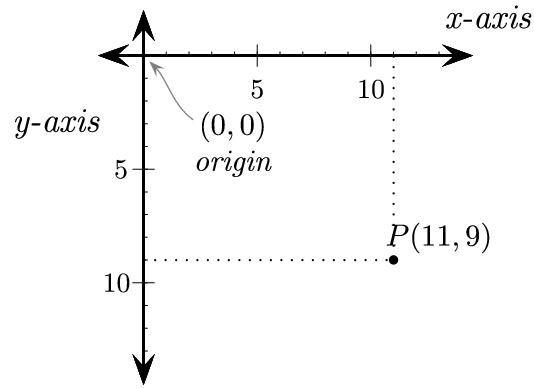

# Coordinate System

# Defining colors
## Define some colors

```
BLACK    = (   0,   0,   0)
WHITE    = ( 255, 255, 255)
GREEN    = (   0, 255,   0)
RED      = ( 255,   0,   0)
BLUE     = (   0,   0, 255)
```

